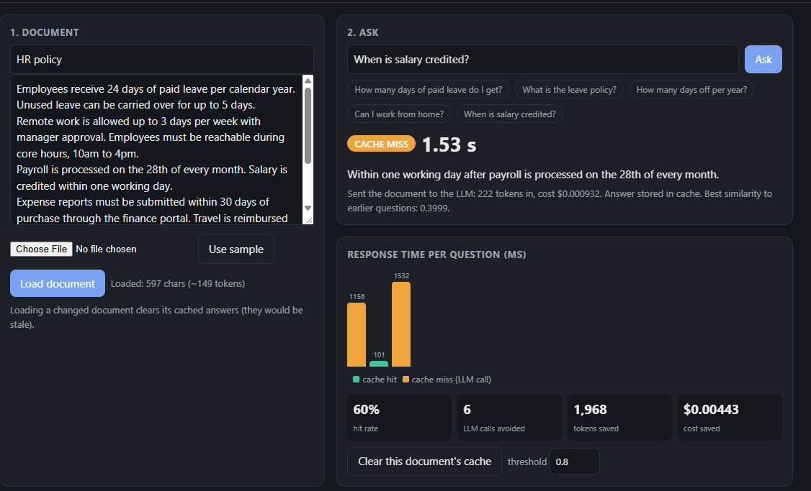
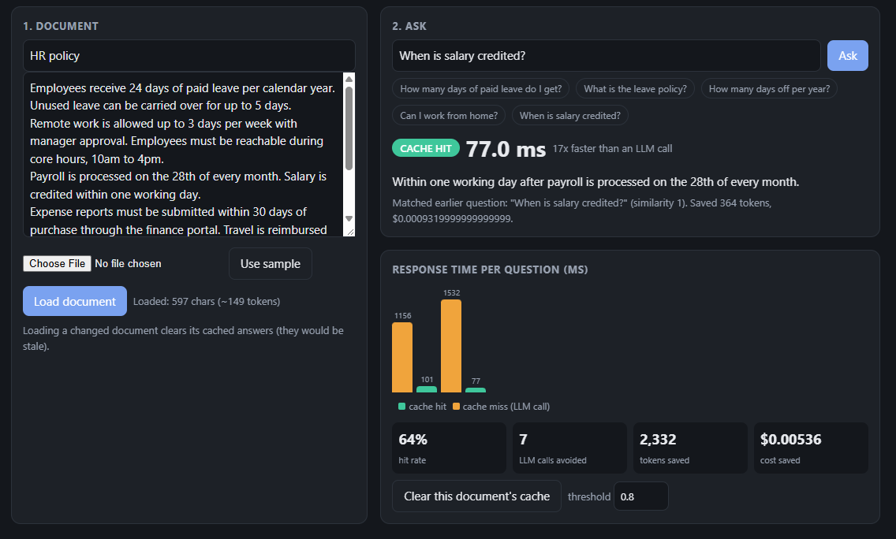
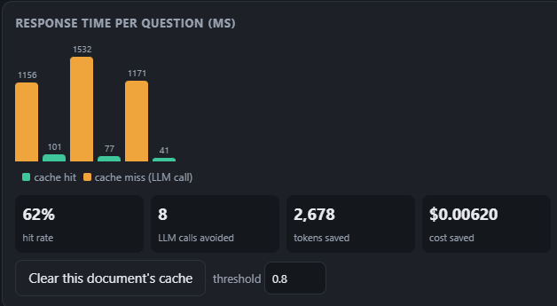
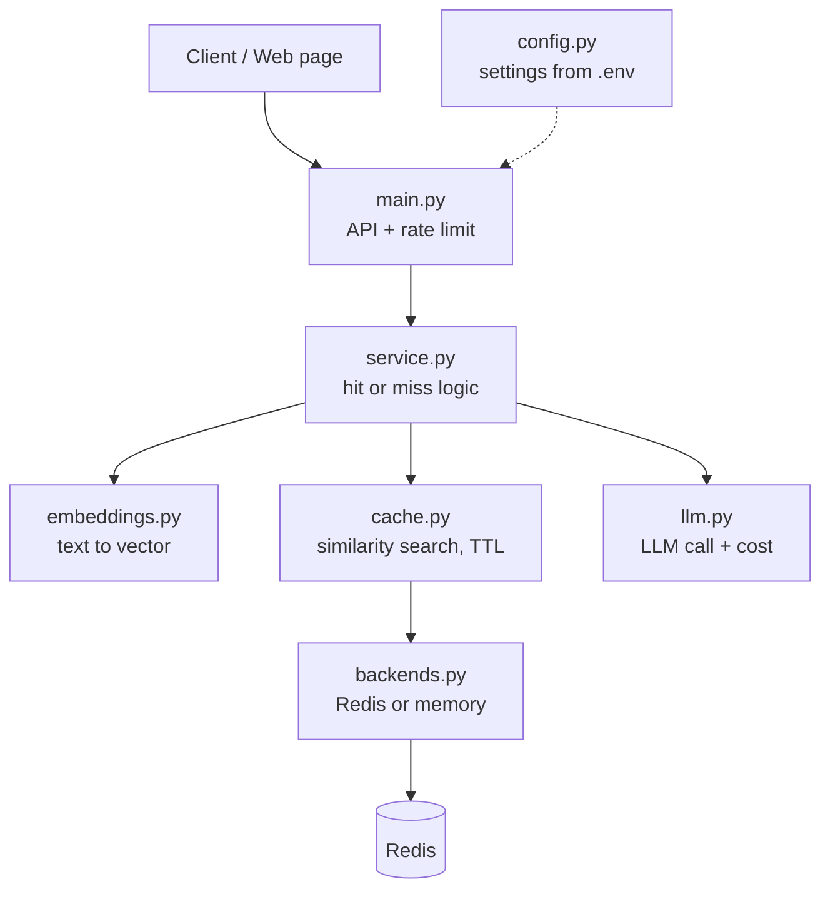

<div align="center">

# Semantic Cache for LLM APIs

**Answer repeated questions in milliseconds instead of calling the LLM again, even when the wording is different.**

[](https://semantic-cache-for-llm-api.onrender.com/)


## Screenshots

### 1. First question: cache miss
The document goes to the LLM and the answer is stored. The timer shows the full LLM latency.



### 2. Reworded question: cache hit
A similar question is answered from the cache in milliseconds, with the matched question and similarity score shown.



### 3. Response times and savings
Orange bars are LLM calls and green bars are cache hits. The cards show hit rate, LLM calls avoided, tokens saved and cost saved.



---

## The problem

Normal caching only works when two requests are identical. Users rarely repeat themselves word for word:

```
"What is our leave policy?"
"How many days off do I get?"
"What is the company's leave allowance?"
```

These are one question asked three ways, and a plain cache would call the LLM three times. This project puts a **semantic cache** in front of the LLM. It turns each question into an embedding, finds a similar earlier question, and returns the stored answer when the similarity is above a threshold.

## What the demo shows

Load a document, then ask questions about it:

| Step | What happens | Typical time |
|---|---|---|
| First question on a topic | **MISS**: the document and question go to the LLM, and the answer is stored | seconds |
| A reworded version of that question | **HIT**: answered from the cache, with no LLM call | milliseconds |
| Edit the document and reload it | That document's cached answers are cleared, because they may be stale | n/a |

The page shows a live timer on misses, a HIT/MISS badge, the matched earlier question and its similarity score, a bar chart of response times, and counters for hit rate, LLM calls avoided, tokens saved and cost saved.

## Architecture



**Request flow**

1. `main.py` checks the rate limit and passes the question to `service.py`.
2. `embeddings.py` converts the question to a vector (SBERT by default for real use).
3. `cache.py` compares it with stored questions in the same namespace using cosine similarity.
4. **Hit** (score at or above the threshold): return the stored answer. No tokens spent.
5. **Miss**: call the LLM, store the answer with a TTL, and return it.
6. Every request updates counters for latency, hits, tokens and cost.

## Features

- **Semantic matching** with a configurable similarity threshold, set globally or per request
- **TTL**, using Redis `EXPIRE`, so old answers expire on their own
- **Cache invalidation**: delete one entry, flush a namespace, or remove everything related to a piece of text (`similar_to`)
- **Namespaces**: each document has its own cache, so answers never leak between documents
- **Response metadata**: hit or miss, similarity score, matched question, entry age, time to expiry, tokens, cost, latency
- **Hit/miss tracking and usage stats** at `/stats`: hit rate, average latency, LLM calls, tokens and cost saved
- **Rate limiting**: fixed window per API key or IP, stored in Redis
- **Redis integration** with an in-memory fallback, so the project runs with no setup
- **Swappable parts**: embedders (SBERT or a lightweight hash embedder for tests) and LLMs (Mistral, Groq, Ollama, any OpenAI-style API, Anthropic, or a mock)

## Quick start

```bash
git clone https://github.com/YOUR_USERNAME/YOUR_REPO.git
cd YOUR_REPO
python -m venv .venv
source .venv/bin/activate          # Windows: .venv\Scripts\activate
pip install -r requirements.txt
pip install sentence-transformers  # real semantic matching (large download, first run only)
cp .env.example .env               # then add your key
python -m uvicorn app.main:app --port 8000
```

Open <http://localhost:8000>, click **Use sample**, then **Load document**, and start asking questions.

### Configuration (`.env`)

```env
# LLM: mock | mistral | ollama | openai_compat | anthropic
LLM_PROVIDER=openai_compat
LLM_BASE_URL=https://api.groq.com/openai/v1
LLM_API_KEY=put-your-key-here
LLM_MODEL=llama-3.1-8b-instant

# Embeddings: sbert (meaning-based) | hash (offline, word-overlap only)
EMBEDDER=sbert
SIM_THRESHOLD=0.8

# Optional
# REDIS_URL=redis://localhost:6379/0
# CACHE_TTL=3600
# RATE_LIMIT=60
```

| Variable | Default | Meaning |
|---|---|---|
| `LLM_PROVIDER` | `mock` | Which LLM backend to use |
| `LLM_MODEL` | provider default | Model name |
| `EMBEDDER` | `hash` | `sbert` for real semantic matching |
| `SIM_THRESHOLD` | `0.8` | Minimum cosine similarity for a hit |
| `CACHE_TTL` | `3600` | Seconds before a cached answer expires |
| `REDIS_URL` | empty | Empty uses the in-memory backend |
| `RATE_LIMIT` / `RATE_WINDOW` | `60` / `60` | Requests per window |
| `PRICE_IN_PER_1K` / `PRICE_OUT_PER_1K` | `0.001` / `0.005` | Prices used for the cost counters |
| `MAX_DOC_CHARS` | `20000` | Largest document accepted |

Never commit `.env`. It is listed in `.gitignore`, and `.env.example` shows the shape with a fake key.

### With Docker (Redis + API)

```bash
docker compose up --build
```

## API

| Endpoint | Purpose |
|---|---|
| `POST /v1/docs` | Store a document and get a `doc_id` |
| `PUT /v1/docs/{id}` | Replace a document and flush its cached answers |
| `POST /v1/ask` | Ask a question about a document (cache first, LLM on a miss) |
| `POST /v1/chat` | Ask without a document, same caching |
| `GET /stats` | Hit rate, latency, LLM calls, tokens and cost saved |
| `POST /cache/invalidate` | Flush a namespace, or remove entries similar to some text |
| `DELETE /cache/{id}` | Remove one cache entry |
| `GET /health` | Active backend, embedder and threshold |

```bash
curl -s localhost:8000/v1/ask -H 'content-type: application/json' \
  -d '{"doc_id":"<id from /v1/docs>","question":"How many days off do I get?"}'
```

Responses carry an `X-Cache: HIT|MISS` header and a `cache` object with the similarity score and matched question.

## Benchmark

`python benchmark.py --embedder sbert --threshold 0.8` replays a workload of repeated and reworded questions with and without the cache.

> **Fill in your own numbers from a run on your machine.** The benchmark uses a simulated LLM, so the latency figures are simulated. Cost and token figures are computed from token counts and the configured prices.

| Metric | No cache | Semantic cache |
|---|---|---|
| Average latency | _TODO_ | _TODO_ |
| Average cost per request | _TODO_ | _TODO_ |
| Cache hit rate | 0% | _TODO_ |
| LLM calls avoided | 0 | _TODO_ |
| Tokens saved | 0 | _TODO_ |
| Wrong-topic hits | 0 | _TODO_ |

## Design decisions

- **Why Redis:** it holds the cache entries with native TTL, the usage counters, and the rate-limit windows, and it is shared by every API instance. The in-memory backend uses the same interface for development and tests.
- **Threshold trade-off:** a higher threshold gives fewer wrong answers but a lower hit rate. The benchmark reports wrong-topic hits so the threshold can be tuned with data. For MiniLM embeddings, 0.8 to 0.9 is a sensible range.
- **Invalidation:** TTL bounds how stale an answer can get. Explicit deletes and namespace flushes handle known changes, and `similar_to` removes everything related to a changed policy without knowing the exact questions.
- **Namespaces:** one per document, so tenants and document versions stay isolated.
- **Embedding off the event loop:** SBERT runs in a worker thread so one slow encode does not stall other requests.
- **Honest benchmarking:** tests and CI use the lightweight hash embedder so they stay fast and need no download. Real matching uses SBERT.

## Testing

```bash
python -m pytest -q
```

Tests cover hit and miss behavior, TTL expiry, namespace isolation, semantic invalidation, stats, the document endpoints, error cases, and the LLM client. They run against both the in-memory backend and a fake Redis. GitHub Actions runs them on every push.

## Limitations

- **Similar but different questions can return a wrong hit.** "Sick leave days" and "paid leave days" are close in meaning, so a loose threshold may serve the wrong answer. Keep the threshold strict and watch the wrong-hit metric.
- **Search is brute force** over one namespace. That is fine up to roughly 10 to 50 thousand entries. Beyond that, move to a RediSearch HNSW vector index.
- **No request coalescing.** Identical questions that arrive at the same moment on a cold cache each call the LLM.
- **The whole document is sent on a miss.** Documents are limited to 20,000 characters and are held in server memory.
- **Free LLM tiers rate-limit.** Misses are sent one at a time with retries to stay inside those limits.

## Roadmap

- [ ] Multi-document knowledge base with chunking and retrieval (RAG), so only relevant passages are sent to the LLM
- [ ] Store documents in Redis so they survive restarts
- [ ] Hybrid scoring (semantic plus keyword) to cut wrong hits on near-identical questions
- [ ] Product search mode with filter-aware cache keys and short TTLs
- [ ] RediSearch vector index for large caches
- [ ] Request coalescing (single flight) for concurrent misses

## Project structure

```
app/
  main.py         API routes, rate limiting, serves the web page
  service.py      core hit/miss logic shared by the API and the benchmark
  cache.py        similarity search, TTL, invalidation
  embeddings.py   SBERT and hash embedders
  llm.py          LLM clients, prompt building, cost calculation
  backends.py     Redis and in-memory storage
  config.py       settings loaded from .env
static/index.html web demo page
tests/            automated tests
benchmark.py      no-cache vs cache comparison
demo.py           terminal demo
Dockerfile, docker-compose.yml, .github/workflows/ci.yml
```

## License

MIT. Replace this with your preferred license and add a `LICENSE` file.
